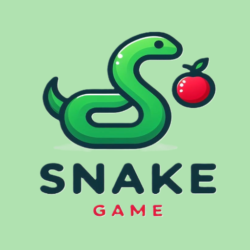

<!-- hal yang diperlukan saat penting di html -->

        

          <h3>-WHAT IS BALL BREAKER?-</h3>
          

            "Ball Breaker Is a Classic Arcade Game Was Released In 1984, Where
            Players Can Control a Paddle To Bounce a Ball And Destroy Bricks."
          

        

<!-- hal yang diperlukan saat penting di css -->

<!-- hal yang saya ingin html -->
<section class="hero" id="Home">
      

        

          <video src="assets/bg.mp4" autoplay muted loop></video>
          <svg viewBox="0 0 1320 300">
            <text x="45%" y="110%" z="50%"  fill="transparent" text-anchor="middle">
              WELCOME
            </text>
          </svg>
            

              "Welcome to this website ,this website can using for playing "RetroGames" you can play 
              many games for satisfy the longing into console games"
            

        

      

    </section>

<!-- hal yang saya ingin css -->
.hero {
    min-height: 100vh;
    position: relative;
    opacity: 0;
    animation: pageIn 4.5s forwards;
    animation-delay: 4.5s;
}

.hero .container .content {
    /* display: flex;
    flex-direction: column;
    justify-content: start;
    align-items: center;
    height: 100vh; */
    padding: 1.4rem 7%;
    max-width: 60rem;
}

.hero .container .content video {
    position: absolute;
    top: 0;
    left: 0;
    right: 0;
    width: 100%;
    height: 100%;
    object-fit: cover;
    opacity: 0;
    animation: pageIn 4.5s forwards;
    animation-delay: 4.5s;
    background: linear-gradient(0deg, rgba(1, 1, 52, 0.8) 8%, rgba(1, 1, 52, 0)50%);
}

.hero .container .content video {
    background: linear-gradient(0deg, rgba(1, 1, 52, 0.8) 8%, rgba(1, 1, 52, 0)50%);

}

.hero .container .content svg {
    z-index: 3;
    margin-bottom: -4rem;
    opacity: 0;
    animation: pageIn 4.5s forwards;
    animation-delay: 4.5s;
}

.hero .container .content svg text {
    text-transform: uppercase;
    font-family: "Shojumaru", system-ui;
    font-size: 15rem;
    animation: stroke 3.5s infinite alternate;
    stroke-width: 3;
    stroke: white;
}

/* .hero .container .content .about {
    display: flex;
    flex-direction: column;
    z-index: 3;
    width: 35%;
    position: relative;
    justify-content: center;
    align-items: center;
} */

.hero .container .content .about p {
    /* text-align: center;
    font-size: 1.1rem;
    opacity: 0;
    animation: fadeIn 1s forwards;
    animation-delay: 4.5s;
    mix-blend-mode: difference; */
    font-size: 1.6rem;
    margin: 1rem;
    line-height: 1.4;
    font-weight: 100;
    text-shadow: 1px 1px 3px rgba(1, 1, 3, 0.5);
    line-height: 1.2;
    mix-blend-mode: difference;
    display: flex;
    justify-content:center;
    align-items: center;
    position: center;
    
}

.blend {
    background: linear-gradient(0deg, rgba(1, 1, 52, 0.8) 8%, rgba(1, 1, 52, 0)50%);
}

<!-- about html -->
<section class="about" id="about">
      

        

          <h2>What it's RetroGames?</h2>
          

            

              
            

            

              <h3>RetroGames</h3>
              

                Retrogames are old-school video games that evoke nostalgia and
                provide classic entertainment. They often feature pixelated
                graphics, iconic characters, and challenging gameplay that
                defined the gaming experience of past decades.
              

            

          

        

      

    </section>

<!-- list -->

  
  
  

  <!--  -->
  

       
      

      

        
       

        

        <h3>-DEFINITION OF SNAKE GAME-</h3>
        
Snake Is An Iconic Old-School Games Where You Navigate a Growing Snake
          To Eat Food, Avoid Walls And Itself, With Increasingly Challenging Speed And Length.
        

      

      

        
      

        

       

       padding: 8rem 7% 1.4rem;

       <!DOCTYPE html <html lang="en">
<head>
    <meta charset="UTF-8">
    <meta name="viewport" content="width=device-width, initial-scale=1.0">
    <title>FAQ Section with Toggle</title>
    <link rel="stylesheet" href="styles.css">
</head>
<body>

    

        <h2>Frequently Asked Questions</h2>
        

            <h3 class="faq-question">What is your return policy? +</h3>
            
Our return policy allows you to return items within 30 days of purchase for a full refund.

        

        

            <h3 class="faq-question">How do I track my order? +</h3>
            
You can track your order using the tracking link sent to your email after shipment.

        

        

            <h3 class="faq-question">Do you ship internationally? +</h3>
            
Yes, we offer international shipping to select countries.

        

        

            <h3 class="faq-question">What payment methods do you accept? +</h3>
            
We accept all major credit cards, PayPal, and bank transfers.

        

    

    
</body>
</html>

<!-- css -->
/* Products Section */
.products .row {
  display: grid;
  grid-template-columns: repeat(auto-fit, minmax(30rem, 1fr));
  gap: 1.5rem;
  margin-top: 4rem;
}

.products .product-card {
  text-align: center;
  border: 1px solid #666;
  padding: 2rem;
}

.products .product-icons {
  display: flex;
  justify-content: center;
  gap: 0.5rem;
}

.products .product-icons a {
  width: 4rem;
  height: 4rem;
  color: #fff;
  margin: 0.3rem;
  border: 1px solid #666;
  border-radius: 50%;
  display: flex;
  justify-content: center;
  align-items: center;
}

.products .product-icons a:hover {
  background-color: var(--primary);
  border: 1px solid var(--primary);
}

.products .product-image {
  padding: 1rem 0;
}

.products .product-image img {
  height: 25rem;
}

.products .product-content h3 {
  font-size: 2rem;
}

.products .product-stars {
  font-size: 1.7rem;
  padding: 0.8rem;
  color: var(--primary);
}

.products .product-stars .star-full {
  fill: var(--primary);
}

.products .product-price {
  font-size: 1.3rem;
  font-weight: bold;
}

.products .product-price span {
  text-decoration: line-through;
  font-weight: lighter;
  font-size: 1rem;
}

<!-- html -->
<!-- product section  -->
<section class="products" id="products">
    <h2>Produk Unggulan Kami</h2>
    
Lorem ipsum dolor sit amet consectetur adipisicing elit. Illo unde eum, ab fuga possimus iste.

    

      

        

          <a href="#"><i data-feather="shopping-cart"></i></a>
          <a href="#" class="item-detail-button"><i data-feather="eye"></i></a>
        

        

          
        

        

          <h3>Coffee Beans 1</h3>
          

            <i data-feather="star" class="star-full"></i>
            <i data-feather="star" class="star-full"></i>
            <i data-feather="star" class="star-full"></i>
            <i data-feather="star" class="star-full"></i>
            <i data-feather="star"></i>
          

          
IDR 30K IDR 55K

        

      

      

        

          <a href="#"><i data-feather="shopping-cart"></i></a>
          <a href="#" class="item-detail-button"><i data-feather="eye"></i></a>
        

        

          
        

        

          <h3>Coffee Beans 1</h3>
          

            <i data-feather="star"></i>
            <i data-feather="star"></i>
            <i data-feather="star"></i>
            <i data-feather="star"></i>
            <i data-feather="star"></i>
          

          
IDR 30K IDR 55K

        

      

      

        

          <a href="#"><i data-feather="shopping-cart"></i></a>
          <a href="#" class="item-detail-button"><i data-feather="eye"></i></a>
        

        

          
        

        

          <h3>Coffee Beans 1</h3>
          

            <i data-feather="star"></i>
            <i data-feather="star"></i>
            <i data-feather="star"></i>
            <i data-feather="star"></i>
            <i data-feather="star"></i>
          

          
IDR 30K IDR 55K

        

      

    

  </section>
  <!-- Products Section end -->